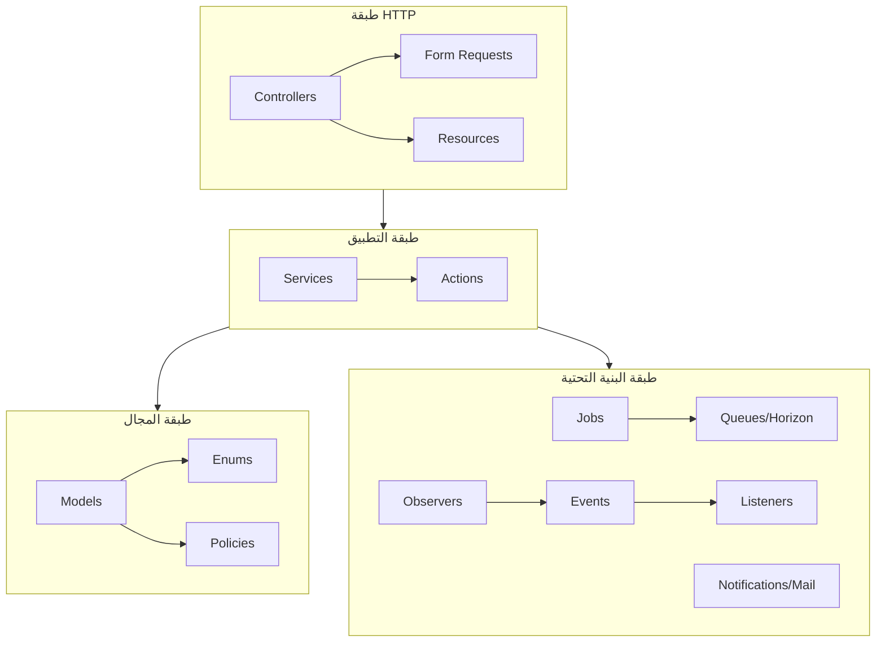

# هيكلية Backend منصة إحياء — Laravel 13

**الإصدار:** v1.0
**التاريخ:** 2026-08-02
**المراجع الملزمة:** `CLAUDE.md` · `docs/design-decisions.md` · `requirements/rate-limiting-spec.md` · `docs/api/routes.md` (49 نقطة API) · `docs/api/enums.md` (الثوابت)

---

## 1. نظرة عامة على المستودع

```
ihyaa-app/                          ← جذر المستودع
├── .github/workflows/ci.yml        ← (انظر ملاحظة CI في القسم 9)
├── docs/
│   ├── api/
│   │   ├── routes.md               ← ✅ معتمد — تعريف الـ 49 نقطة API + Rate Limiters
│   │   └── enums.md                ← ✅ معتمد — القيم الثابتة (الأدوار، الحالات، الحدود)
│   └── architecture/
│       ├── backend-structure.md    ← هذا الملف
│       ├── middleware.md           ← الـ Middleware + Rate Limiting (7 مستويات)
│       └── horizon-config.md       ← إعدادات Horizon (4 قوائم)
├── backend/                        ← تطبيق Laravel 13 الكامل (هذا المستند)
│   ├── .env.example
│   ├── .github/workflows/ci.yml    ← CI (Pest + Pint + Build)
│   ├── docker-compose.yml          ← MySQL 8 + Redis 7 + Meilisearch
│   ├── README.md                   ← دليل التشغيل المحلي
│   └── ... (شجرة التطبيق — القسم 3)
└── frontend/                       ← Next.js 16 (مستودع/مجلد منفصل — خارج نطاق هذا المستند)
```

## 2. مبادئ التقسيم (Layering)



قواعد إلزامية:

1. **Controllers رفيعة (Thin)** — لا منطق أعمال؛ تستدعي Service واحداً وتُرجع Resource.
2. **Services للعمليات متعددة الخطوات** — بلا حالة (Stateless)، الحقن عبر Constructor.
3. **Actions لعملية واحدة قابلة لإعادة الاستخدام** (خطوة واحدة داخل Service أو مستقلة).
4. **Jobs للمعالجة غير المتزامنة فقط** — تُستخدم في Queue، ولا تُستدعى من Controller مباشرة.
5. **الوصول إلى قاعدة البيانات عبر Eloquent Models فقط** — لا Query Builder خام في Services.
6. **التحقق من الأدوار مرتان**: Middleware (فصل الأدوار) + Policies (تفويضات دقيقة: ملكية، إفصاح) — راجع `middleware.md` و`routes.md` §5.
7. **العدادات في Redis فقط** — لا جدول `rate_limits` في MySQL (rate-limiting-spec §6.4 / SRS-NFR-19).
8. **لا S3/R2** — تخزين محلي `FILESYSTEM_DISK=public`.
9. **لا بريد جماعي** — `verification-emails` تحمل رسائل المعاملات فقط (OTP، تحقق، إشعارات).
10. **البنية تتبع المراجع المعتمدة حرفياً** — أي تغيير يجب أن يحدّث `routes.md`/`enums.md` أولاً.

## 3. شجرة المجلدات الكاملة

```
backend/
├── .env.example                     ← قالب المتغيرات (يُنسخ إلى .env)
├── .github/
│   └── workflows/
│       └── ci.yml                   ← Pest + Pint + Build check
├── docker-compose.yml               ← MySQL 8 + Redis 7 + Meilisearch
├── README.md                        ← دليل التشغيل المحلي
├── composer.json                    ← اعتماديات: sanctum, socialite, horizon, reverb, scout, meilisearch-php, pest, pint
├── app/
│   ├── Actions/                     ← عمليات أحادية الغرض (تُستدعى من Services/Jobs)
│   │   ├── AiEvaluation/
│   │   │   ├── AggregateEvaluationAction.php      ← تجميع درجات 5 أبعاد (أوزان معتمدة)
│   │   │   └── GenerateGapAnalysisAction.php      ← تحليل الفجوات + التوصيات + المهارات
│   │   ├── Auth/
│   │   │   ├── GenerateOtpAction.php              ← توليد OTP (TTL 60 ثانية — Redis)
│   │   │   └── VerifyOtpAction.php                ← تحقق + استهلاك رمز واحد
│   │   ├── Interest/
│   │   │   ├── AcceptInterestAction.php           ← قبول → PDF + كشف الإيميل
│   │   │   └── RejectInterestAction.php           ← رفض + سبب اختياري
│   │   ├── Notification/
│   │   │   └── CreateNotificationAction.php       ← إنشاء إشعار DB (قابل للتوسيع)
│   │   ├── Project/
│   │   │   ├── CreateProjectAction.php            ← إنشاء + تقييم تلقائي
│   │   │   ├── UpdateProjectAction.php            ← تحديث + كشف التغييرات الجوهرية
│   │   │   ├── RestoreProjectAction.php           ← استرجاع من السلة (30 يوماً)
│   │   │   └── SoftDeleteProjectAction.php        ← حذف مؤقت
│   │   └── Search/
│   │       └── SyncProjectToSearchAction.php      ← مزامنة فهرس Meilisearch
│   ├── Console/
│   │   └── Commands/
│   │       ├── PurgeTrashedProjects.php           ← `projects:purge-trash` (يومياً — 30 يوماً)
│   │       └── PruneExpiredTokens.php             ← `tokens:prune` (يومياً — Sanctum 24h)
│   ├── Enums/                       ← القيم من docs/api/enums.md (مصدر واحد للحقيقة)
│   │   ├── UserRole.php             ← IDEA_OWNER / INVESTOR / ADMIN
│   │   ├── ProjectStatus.php        ← DRAFT / PUBLISHED / ARCHIVED
│   │   ├── ProjectState.php         ← COMPLETED / NEEDS_DEVELOPMENT / NEEDS_FUNDING
│   │   ├── EvaluationStatus.php     ← PROCESSING / COMPLETED / FAILED / PARTIAL
│   │   ├── EvaluationDimension.php  ← TECHNICAL(25) / INNOVATION(25) / MARKET(20) / TEAM(15) / DOCUMENTATION(15)
│   │   ├── InterestStatus.php       ← PENDING / ACCEPTED / REJECTED / CANCELLED
│   │   ├── InterestType.php         ← INVESTMENT / TECHNICAL_DEVELOPMENT / CONSULTATION
│   │   ├── FileType.php             ← IMAGE / PDF
│   │   ├── VideoProvider.php        ← YOUTUBE / VIMEO
│   │   ├── AnalysisType.php         ← COMPETITIVE / SWOT / MARKET / COMPARISON
│   │   └── ModelUsed.php            ← OPENAI / CLAUDE
│   ├── Events/                      ← أحداث المجال (راجع القسم 6)
│   │   ├── InterestReceived.php     ← Broadcast → private-users.{owner_id} (حرج)
│   │   ├── EvaluationCompleted.php  ← Broadcast → private-users.{owner_id} (حرج)
│   │   ├── ProjectCreated.php
│   │   ├── ProjectUpdated.php
│   │   ├── ProjectTrashed.php
│   │   ├── ProjectRestored.php
│   │   ├── InterestAccepted.php
│   │   ├── InterestRejected.php
│   │   └── EmailVerified.php
│   ├── Exceptions/
│   │   └── Api/
│   │       ├── ApiException.php                ← أساسية (code موحّد + HTTP status)
│   │       ├── OtpExpiredException.php         ← 422 OTP_EXPIRED
│   │       ├── OtpMaxAttemptsException.php     ← 429 OTP_MAX_ATTEMPTS
│   │       ├── DuplicateInterestException.php  ← 409 INTEREST_EXISTS
│   │       └── EvaluationInProgressException.php ← 409 EVALUATION_IN_PROGRESS
│   ├── Http/
│   │   ├── Controllers/
│   │   │   ├── Controller.php                  ← الأساسية (trait: JsonResponse موحّد)
│   │   │   └── Api/                            ← مطابقة تامة مع routes.md
│   │   │       ├── Auth/AuthController.php     ← register/login/logout/forgot/reset/verifyEmail
│   │   │       ├── Auth/OAuthController.php    ← redirect/callback (3 موفرين)
│   │   │       ├── Profile/ProfileController.php ← show/update/uploadAvatar/showPublic
│   │   │       ├── Project/ProjectController.php ← index/show/store/update/destroy/evaluations
│   │   │       ├── Project/FileController.php  ← upload (صور 5×5MB / PDF 3×10MB)
│   │   │       ├── Project/TrashController.php ← index/restore/forceDelete
│   │   │       ├── Project/SavedProjectController.php ← index/save/unsave
│   │   │       ├── Evaluation/EvaluationController.php ← evaluate/reEvaluate/retry/status
│   │   │       ├── Evaluation/ReportController.php ← export (PDF — مستوى الإفصاح 3)
│   │   │       ├── Search/SearchController.php ← search/suggestions
│   │   │       ├── Search/TagController.php    ← tagSuggestions (حتى 10)
│   │   │       ├── Interest/InterestController.php ← store/received/sent/accept/reject/cancel
│   │   │       ├── Agreement/AgreementController.php ← show (الطرفان فقط)
│   │   │       ├── Notification/NotificationController.php ← index/markRead/markAllRead/unreadCount
│   │   │       ├── Dashboard/DashboardController.php ← ideaOwner/investor (20/دقيقة)
│   │   │       ├── Admin/AdminController.php   ← analytics/export (seeder فقط)
│   │   │       ├── Ai/AIAgentController.php    ← analyze/show (analysis_type)
│   │   │       └── Health/HealthController.php ← /health /ready (L7 — بدون Rate Limit)
│   │   ├── Middleware/             ← التفاصيل الكاملة في middleware.md
│   │   │   ├── AbstractRoleMiddleware.php      ← أساس الدور المشترك
│   │   │   ├── IdeaOwnerMiddleware.php         ← alias: idea-owner
│   │   │   ├── InvestorMiddleware.php          ← alias: investor
│   │   │   ├── AdminMiddleware.php             ← alias: admin
│   │   │   ├── EnsureEmailVerified.php         ← alias: email.verified
│   │   │   ├── SetLocale.php                   ← Accept-Language (ar/en)
│   │   │   ├── RefreshSanctumToken.php         ← تمديد 24h عند الاستخدام (SRS-NFR-07)
│   │   │   └── TrackRateLimitViolations.php    ← التصعيد 3 مستويات (rate-limiting-spec §7)
│   │   ├── Requests/               ← تحقق عند الحدود (schema validation)
│   │   │   ├── Auth/RegisterRequest.php, LoginRequest.php, ForgotPasswordRequest.php,
│   │   │   │      ResetPasswordRequest.php, VerifyEmailRequest.php, OAuthCallbackRequest.php
│   │   │   ├── Profile/UpdateProfileRequest.php, UploadAvatarRequest.php
│   │   │   ├── Project/StoreProjectRequest.php, UpdateProjectRequest.php, UploadFilesRequest.php
│   │   │   ├── Interest/StoreInterestRequest.php (message ≤ 500 حرف)
│   │   │   └── Ai/AnalyzeRequest.php (analysis_type من enums.md)
│   │   └── Resources/              ← مخرجات API (مفاتيح camelCase)
│   │       ├── UserResource.php               ← يتضمن role و avatarUrl
│   │       ├── ProjectResource.php            ← يطبّق مصفوفة الإفصاح visibility_level 1/2/3
│   │       ├── ProjectCardResource.php        ← بطاقة المعرض (بدون تقرير)
│   │       ├── EvaluationResource.php         ← تقرير + Radar Chart data
│   │       ├── EvaluationStatusResource.php   ← حالة التقييم (WebSocket friendly)
│   │       ├── InterestResource.php           ← مع projectId + investor
│   │       ├── AgreementResource.php
│   │       ├── NotificationResource.php       ← مع is_critical
│   │       ├── SavedProjectResource.php
│   │       ├── SearchResultResource.php
│   │       └── DashboardResource.php          ← إحصاءات اللوحات
│   ├── Jobs/                        ← القوائم الأربع + default (راجع القسم 5)
│   │   ├── AiEvaluation/
│   │   │   ├── RunAiEvaluationJob.php         ← queue: ai-evaluation · timeout 180 · tries 2
│   │   │   ├── EvaluateDimensionJob.php       ← queue: ai-evaluation · timeout 45 · tries 2 (5 نسخ)
│   │   │   └── GenerateGapAnalysisJob.php     ← queue: ai-evaluation · timeout 120 · tries 2
│   │   ├── Notifications/
│   │   │   ├── SendOtpEmailJob.php            ← queue: verification-emails · tries 3
│   │   │   ├── SendVerificationEmailJob.php   ← queue: verification-emails · tries 3
│   │   │   └── SendNotificationEmailJob.php   ← queue: verification-emails · tries 3
│   │   ├── FileProcessing/
│   │   │   └── ProcessUploadedFileJob.php     ← queue: file-processing · timeout 300 · tries 2
│   │   ├── Search/
│   │   │   └── SyncProjectToSearchJob.php     ← queue: search-indexing · tries 3
│   │   └── Agreement/
│   │       └── GenerateAgreementPdfJob.php    ← queue: default · backoff 300 (UC-07 A1)
│   ├── Mail/
│   │   ├── OtpMail.php                        ← رمز الدقيقة الواحدة
│   │   ├── VerificationMail.php
│   │   ├── ResetPasswordMail.php              ← رابط صالح ساعة
│   │   ├── InterestReceivedMail.php           ← لصاحب الفكرة
│   │   └── InterestAcceptedMail.php           ← كشف البريد الإلكتروني للطرفين
│   ├── Models/                      ← مفرد PascalCase
│   │   ├── User.php                 ← role: UserRole (قابل للتعيين مرة واحدة من null)
│   │   ├── SocialAccount.php        ← provider + provider_id (unique زوجي)
│   │   ├── Project.php              ← Searchable + SoftDeletes + علاقات
│   │   ├── ProjectFile.php
│   │   ├── Evaluation.php           ← last_evaluation_at (Cache 24h)
│   │   ├── EvaluationDimension.php
│   │   ├── Interest.php
│   │   ├── Agreement.php
│   │   └── SavedProject.php
│   ├── Notifications/               ← إشعارات DB (Laravel Notifications)
│   │   ├── InterestReceivedNotification.php   ← is_critical = true
│   │   ├── EvaluationCompletedNotification.php ← is_critical = true
│   │   ├── InterestAcceptedNotification.php
│   │   └── InterestRejectedNotification.php
│   ├── Observers/
│   │   ├── UserObserver.php         ← created → SendVerificationEmailJob
│   │   └── ProjectObserver.php      ← created → تقييم تلقائي + فهرسة
│   │                               ← updated → فهرسة + إعادة تقييم عند تغييرات جوهرية (SRS-F04-02)
│   │                               ← deleted/restored → مزامنة الفهرس
│   ├── Policies/                    ← تفويضات دقيقة (routes.md §5)
│   │   ├── ProjectPolicy.php        ← update/destroy: ملكية · view: إفصاح 1/2/3
│   │   ├── EvaluationPolicy.php     ← view/export: Owner دائماً / Investor بعد قبول
│   │   ├── InterestPolicy.php       ← accept/reject: صاحب المشروع فقط
│   │   ├── AgreementPolicy.php      ← view: الطرفان (idea_owner_id / investor_id)
│   │   └── SavedProjectPolicy.php   ← save: دور investor فقط
│   ├── Providers/
│   │   ├── AppServiceProvider.php   ← Named Rate Limiters (7 مستويات) + Observers
│   │   └── HorizonServiceProvider.php ← Gate لوحة Horizon (admin فقط)
│   ├── Rules/
│   │   ├── ValidVideoUrlRule.php    ← YouTube/Vimeo فقط (embed + regex)
│   │   └── ValidFileMimeRule.php    ← MIME حقيقي (لا امتداد) — منع التنفيذيات
│   ├── Services/                    ← العمليات متعددة الخطوات (راجع القسم 4)
│   │   ├── Auth/AuthService.php
│   │   ├── Auth/OtpService.php
│   │   ├── Auth/OAuthService.php
│   │   ├── Profile/ProfileService.php
│   │   ├── Project/ProjectService.php
│   │   ├── Storage/FileService.php
│   │   ├── Ai/EvaluationService.php
│   │   ├── Ai/AiProviderService.php
│   │   ├── Ai/AiCacheService.php
│   │   ├── Interest/InterestService.php
│   │   ├── Agreement/AgreementService.php
│   │   ├── Notification/NotificationService.php
│   │   ├── Search/SearchService.php
│   │   ├── Dashboard/DashboardService.php
│   │   └── Analytics/AnalyticsService.php
│   └── Support/
│       └── ApiResponse.php         ← موحّد: {code, message, data?, errors?}
├── bootstrap/
│   ├── app.php                     ← aliases الـ Middleware + معالجة الاستثناءات (429/403/422)
│   └── providers.php
├── config/
│   ├── app.php · auth.php · cache.php · database.php · filesystems.php
│   ├── queue.php · session.php · mail.php · logging.php · cors.php
│   ├── sanctum.php                 ← token 24h + abilities
│   ├── services.php                ← socialite (google/github/linkedin) + openai + claude
│   ├── scout.php                   ← SCOUT_DRIVER=meilisearch + filterable/sortable
│   ├── horizon.php                 ← القوائم الأربع (راجع horizon-config.md)
│   ├── reverb.php                  ← WebSocket — أحداث حرجة فقط
│   └── otp.php                     ← مخصص: TTL 60s + maxAttempts 3
├── database/
│   ├── factories/
│   │   ├── UserFactory.php         ← states: ideaOwner()/investor()/admin()
│   │   ├── ProjectFactory.php
│   │   ├── EvaluationFactory.php
│   │   └── InterestFactory.php
│   ├── migrations/                 ← ترقيم Laravel + الطوابع الزمنية
│   │   ├── 0001_01_01_000000_create_users_table.php
│   │   ├── 0001_01_01_000001_create_cache_table.php
│   │   ├── 0001_01_01_000002_create_jobs_table.php
│   │   ├── 0001_01_01_000003_create_personal_access_tokens_table.php
│   │   ├── 2026_08_01_000001_create_social_accounts_table.php
│   │   ├── 2026_08_01_000002_create_projects_table.php
│   │   ├── 2026_08_01_000003_create_project_files_table.php
│   │   ├── 2026_08_01_000004_create_evaluations_table.php
│   │   ├── 2026_08_01_000005_create_evaluation_dimensions_table.php
│   │   ├── 2026_08_01_000006_create_interests_table.php
│   │   ├── 2026_08_01_000007_create_agreements_table.php
│   │   ├── 2026_08_01_000008_create_saved_projects_table.php
│   │   └── 2026_08_01_000009_create_notifications_table.php
│   └── seeders/
│       ├── DatabaseSeeder.php      ← يستدعي AdminUserSeeder (+ DemoDataSeeder في local فقط)
│       ├── AdminUserSeeder.php     ← الحساب الوحيد لدور admin — لا تسجيل عام
│       └── DemoDataSeeder.php      ← local/testing: 10 مستثمرين + 50 مشروع
├── lang/
│   ├── ar/
│   │   ├── messages.php            ← رسائل API العامة
│   │   ├── rate_limit.php          ← رسالة 429 العربية
│   │   └── validation.php
│   └── en/
│       ├── messages.php
│       ├── rate_limit.php          ← "Too many requests..."
│       └── validation.php
├── public/
│   └── index.php
├── resources/
│   └── views/
│       ├── emails/                 ← otp.blade.php · verification.blade.php · password-reset.blade.php
│       │                              interest-received.blade.php · interest-accepted.blade.php
│       └── pdfs/
│           └── agreement.blade.php ← مستند الاتفاق الثابت (اسم الطرفين فقط)
├── routes/
│   ├── api.php                     ← الـ 49 نقطة — التعريف المعتمد في docs/api/routes.md
│   ├── channels.php                ← private-users.{user_id} (Reverb — Sanctum)
│   ├── console.php                 ← جدولة: projects:purge-trash يومياً · tokens:prune يومياً
│   └── web.php                     ← فارغ تقريباً (REST فقط) — صفحة Horizon تُسجَّل تلقائياً
├── storage/
│   └── app/public/                 ← FILESYSTEM_DISK=public (لا S3/R2)
│       ├── projects/               ← ملفات المشاريع (صور + PDF)
│       ├── avatars/                ← صور المستخدمين (≤ 2MB)
│       └── agreements/             ← مستندات الاتفاق PDF
└── tests/
    ├── Unit/
    │   ├── Services/OtpServiceTest.php · EvaluationServiceTest.php · SearchServiceTest.php
    │   ├── Rules/ValidVideoUrlRuleTest.php
    │   └── Enums/UserRoleTest.php
    ├── Feature/
    │   ├── Auth/RegisterTest.php · LoginTest.php · OAuthTest.php · OtpTest.php · RateLimitAuthTest.php
    │   ├── Projects/ProjectCrudTest.php · TrashTest.php · FilesTest.php
    │   ├── Interests/InterestFlowTest.php · AgreementTest.php
    │   ├── Search/SearchTest.php
    │   ├── Middleware/RoleMiddlewareTest.php · RateLimitViolationsTest.php
    │   └── Admin/AnalyticsTest.php
    ├── AI/
    │   ├── AiEvaluationTest.php    ← التقييم الكامل + Cache 24h + partial 3/5
    │   ├── AiFallbackTest.php      ← OpenAI→Claude مع تسجيل السبب
    │   ├── PromptInjectionTest.php ← حقن البرومبت (مطلوب — CLAUDE.md)
    │   └── BiasTest.php            ← تحيّز نتائج (مطلوب)
    ├── Pest.php
    └── TestCase.php
```

## 4. الخدمات (Services)

| الخدمة | المسؤولية | الطرق الرئيسية |
|--------|-----------|----------------|
| `AuthService` | تسجيل/دخول/خروج/تحقق إيميل/استعادة كلمة المرور | `register()`, `login()`, `logout()`, `verifyEmail()`, `forgotPassword()`, `resetPassword()` |
| `OtpService` | OTP بصلاحية **دقيقة واحدة** (Redis) + 3 محاولات | `generate()`, `verify()`, `consume()`, `canResend()`, `attemptsLeft()` |
| `OAuthService` | Socialite (Google/GitHub/LinkedIn) + **اختيار الدور عند أول دخول** | `redirectToProvider()`, `handleCallback()`, `assignInitialRole()` |
| `ProfileService` | الملف الشخصي حسب الدور (enums.md §1.14) + الصورة | `show()`, `update()`, `uploadAvatar()` |
| `ProjectService` | CRUD + نشر/أرشيف + سلة المهملات (30 يوماً) | `create()`, `update()`, `trash()`, `restore()`, `forceDelete()`, `trashed()`, `published()` |
| `FileService` | تخزين محلي `public` + MIME حقيقي + حدود enums.md §2.3 | `uploadProjectFiles()`, `uploadAvatar()`, `delete()`, `validateVideoUrl()` |
| `EvaluationService` | تنسيق 5 Sub-Agents + سقف 180s + نتيجة جزئية 3/5 | `evaluate()`, `reEvaluate()`, `retry()`, `status()`, `latestCompleted()` |
| `AiProviderService` | OpenAI أساسي / Claude احتياطي + Retry (0/3/9 ثوانٍ) | `analyze()`, `fallbackReason()`, `extractJson()`, `isHealthy()` |
| `AiCacheService` | Cache **24 ساعة** + إبطال عند التغييرات الجوهرية | `remember()`, `invalidate()`, `isFresh()`, `lastEvaluationAt()` |
| `InterestService` | طلب/قبول/رفض/إلغاء + منع التكرار (SRS-F08-03) | `create()`, `accept()`, `reject()`, `cancel()`, `received()`, `sent()` |
| `AgreementService` | PDF ثابت < 5 ثوانٍ + كشف البريد عند القبول | `generatePdf()`, `download()`, `parties()` |
| `NotificationService` | DB + **Reverb للأحداث الحرجة فقط** + بريد | `sendInApp()`, `broadcastCritical()`, `sendEmail()`, `markRead()`, `unreadCount()` |
| `SearchService` | Meilisearch عبر Scout + فلاتر + اقتراحات | `search()`, `suggestions()`, `tagSuggestions()`, `syncIndexSettings()` |
| `DashboardService` | إحصاءات اللوحات (آخر 10 أحداث / 10 مقترحات) | `ideaOwnerStats()`, `investorStats()` |
| `AnalyticsService` | تحليلات المشرف + تصدير CSV | `platformStats()`, `exportCsv()` |

## 5. المهام (Jobs) وخرائط القوائم

| المهمة | القائمة | Timeout | Tries | Backoff | ملاحظة |
|--------|---------|---------|-------|---------|--------|
| `RunAiEvaluationJob` | `ai-evaluation` | 180s | 2 | 10s | المنسّق — يوزّع 5 أبعاد |
| `EvaluateDimensionJob` | `ai-evaluation` | 45s | 2 | 3s | Sub-Agent لكل بُعد — 5 نسخ متوازية |
| `GenerateGapAnalysisJob` | `ai-evaluation` | 120s | 2 | 10s | الفجوات + التوصيات + المهارات |
| `SendOtpEmailJob` | `verification-emails` | 60s | 3 | 5s | بريد المعاملات فقط — لا جماعي |
| `SendVerificationEmailJob` | `verification-emails` | 60s | 3 | 5s | |
| `SendNotificationEmailJob` | `verification-emails` | 60s | 3 | 5s | |
| `ProcessUploadedFileJob` | `file-processing` | 300s | 2 | 10s | تحقق MIME + أبعاد الصور |
| `SyncProjectToSearchJob` | `search-indexing` | 60s | 3 | 5s | مزامنة فهرس (fallback لـ Scout) |
| `GenerateAgreementPdfJob` | `default` | 60s | 3 | 300s | إعادة بعد 5 دقائق (UC-07 A1) |

**قيود التقييم (من enums.md §2.4):**
- 3 تقييمات متزامنة كحد أقصى لكل مستخدم في Queue → Middleware `LimitConcurrentEvaluations` (راجع horizon-config.md).
- حد أدنى 24 ساعة بين التقييمين → `AiCacheService` + عمود `last_evaluation_at`.
- إعادة التقييم اليدوي: 3/دقيقة لكل (user + project) عبر `throttle:ai.evaluate`.

## 6. الأحداث (Events) والإشعارات

| الحدث | Broadcast (Reverb) | القناة | الإجراء المترتب |
|-------|--------------------|--------|-----------------|
| `InterestReceived` | نعم — **حرج** | `private-users.{owner_id}` | إشعار DB + `SendNotificationEmailJob` |
| `EvaluationCompleted` | نعم — **حرج** | `private-users.{owner_id}` | إشعار DB + تحديث Cache |
| `ProjectCreated` | لا | — | تقييم تلقائي + فهرسة |
| `ProjectUpdated` | لا | — | فهرسة + إعادة تقييم عند **تغييرات جوهرية فقط** (SRS-F04-02) |
| `ProjectTrashed` / `ProjectRestored` | لا | — | مزامنة الفهرس |
| `InterestAccepted` | لا | — | `GenerateAgreementPdfJob` + كشف الإيميل + إشعار |
| `InterestRejected` | لا | — | إشعار للمستثمر |
| `EmailVerified` | لا | — | تحديث `email_verified_at` |

**ملاحظة:** بقية الأحداث (قبول/رفض/تعديل/إعادة تقييم) عند إعادة تحميل الصفحة فقط — لا WebSocket (enums.md §2.9).

## 7. قاعدة البيانات (MySQL)

| الجدول | الأعمدة الأساسية | الفهارس |
|--------|------------------|---------|
| `users` | `role` (enum، null في أول OAuth) · `email` unique · `password` · `avatar_path` · `email_verified_at` · `locale` | `(role)` |
| `social_accounts` | `user_id` FK · `provider` · `provider_id` | unique `(provider, provider_id)` · `(user_id)` |
| `projects` | `user_id` FK · `title` · `description` (50–2000) · `tags` JSON (≤10) · `category` · `budget_min/max` · `business_info` · `github_url` · `video_url` + `video_provider` · `project_state` · `project_status` (draft/published/archived) · `last_evaluation_at` · **softDeletes** | `(user_id)` · `(category)` · `(project_status)` |
| `project_files` | `project_id` FK · `path` · `original_name` · `mime` · `size` · `file_type` | `(project_id)` |
| `evaluations` | `project_id` FK · `status` (processing/completed/failed/partial) · `overall_score` · `model_used` (openai/claude) · `report` JSON · `error` | `(project_id, status)` |
| `evaluation_dimensions` | `evaluation_id` FK · `key` · `name` · `score` · `sub_scores` JSON · `strengths` JSON · `gaps` JSON · `recommendations` JSON · `weight` | `(evaluation_id)` |
| `interests` | `project_id` FK · `investor_id` FK · `interest_type` · `message` (≤500) · `status` · `rejection_reason` | `(project_id, status)` · `(investor_id)` |
| `agreements` | `interest_id` FK unique · `pdf_path` · `generated_at` | `(interest_id)` |
| `saved_projects` | `user_id` FK · `project_id` FK | unique `(user_id, project_id)` |
| `notifications` | بنية Laravel + `is_critical` bool | `(notifiable_id, read_at)` |

**جداول النظام (Laravel):** `cache` · `cache_locks` · `jobs` · `job_batches` · `failed_jobs` · `personal_access_tokens` (Sanctum — 24h) · `password_reset_tokens` (ساعة واحدة).

**لا جدول `rate_limits`** — العدادات في Redis فقط (SRS-NFR-19). **لا PostgreSQL** — MySQL حصرياً.

### مفاتيح Redis

| المفتاح | TTL | الاستخدام |
|---------|-----|-----------|
| `otp:{email}` | 60s | رمز الدقيقة الواحدة + عدد المحاولات |
| `ai:eval:{project_id}` | 86400s | Cache تقرير التقييم (24 ساعة) |
| `eval:lock:{user_id}` | 180s | قفل 3 تقييمات متزامنة لكل مستخدم |
| `rate_limit_violations:{key}` | 3600s | عدّاد الانتهاكات (التبليغ/التصعيد) |
| `laravel_database_*` | — | Queues + Cache + Locks |
| `horizon:*` | — | حالة Horizon |

## 8. التكوين (Config) والمتغيرات

| الملف | الغرض | الملاحظات |
|-------|-------|-----------|
| `config/cache.php` | `CACHE_STORE=redis` | العدادات + OTP + AI Cache |
| `config/queue.php` | `QUEUE_CONNECTION=redis` | عبر Horizon (راجع horizon-config.md) |
| `config/scout.php` | Meilisearch | `filterable`: category/score/status · `sortable`: score/created_at · `searchable`: title/description/tags |
| `config/sanctum.php` | توكن 24h | `expiration: 1440` + abilities: `projects:manage` وغيرها |
| `config/services.php` | Socialite + OpenAI + Claude | `google/github/linkedin` · `openai.api_key` · `claude.api_key` |
| `config/reverb.php` | WebSocket | `providers.users.driver = sanctum` · أحداث حرجة فقط |
| `config/horizon.php` | 4 قوائم | ai-evaluation / verification-emails / file-processing / search-indexing |
| `config/otp.php` | مخصص | `ttl: 60` · `max_attempts: 3` |
| `config/filesystems.php` | `default = public` | لا S3/R2 في MVP |
| `config/cors.php` | Next.js origins | `allowed_origins`: localhost:3000 + نطاق Vercel |

**أهم مفاتيح `.env`:** `APP_NAME=Ihyaa` · `DB_*` (مطابقة docker-compose) · `CACHE_STORE=redis` · `SESSION_DRIVER=redis` · `QUEUE_CONNECTION=redis` · `FILESYSTEM_DISK=public` · `MEILISEARCH_HOST=http://127.0.0.1:7700` · `MEILISEARCH_KEY=ihyaa_meili_master_key` · `REVERB_*` · `GOOGLE_CLIENT_*` · `GITHUB_CLIENT_*` · `LINKEDIN_CLIENT_*` · `OPENAI_API_KEY` · `CLAUDE_API_KEY` · `MAIL_MAILER=log` (dev) / SMTP (prod).

## 9. CI — ملاحظة موقع الملف

GitHub Actions لا يكتشف الملفات إلا من `.github/workflows/` **على جذر المستودع**. الملف مكتوب في `backend/.github/workflows/ci.yml` — إن كان جذر مستودع `ihyaa-app` نفسه، انسخه إلى `ihyaa-app/.github/workflows/ci.yml` (سطر `working-directory: backend` يبقى كما هو).

## 10. جدولة الأوامر (`routes/console.php`)

| الأمر | الجدولة | الوصف |
|-------|---------|-------|
| `projects:purge-trash` | يومياً 03:00 | الحذف النهائي بعد 30 يوماً (SRS-F02-06) |
| `tokens:prune` | يومياً 04:00 | تنظيف توكنات Sanctum المنتهية |

## 11. التثبيت من الصفر (للتوثيق فقط — الهيكل جاهز)

```bash
composer create-project laravel/laravel backend
cd backend
composer require laravel/sanctum laravel/socialite laravel/horizon laravel/reverb laravel/scout meilisearch/meilisearch-php
composer require --dev laravel/pest pestphp/pest-plugin-laravel laravel/pint
php artisan install:api --no-interaction
php artisan install:broadcasting --no-interaction   # يثبّت Reverb
php artisan vendor:publish --provider="Laravel\Horizon\HorizonServiceProvider"
php artisan vendor:publish --provider="Laravel\Scout\ScoutServiceProvider"
```

*نهاية الوثيقة — أي تعارض مع `routes.md` أو `enums.md` يُحل لصالحهما.*
