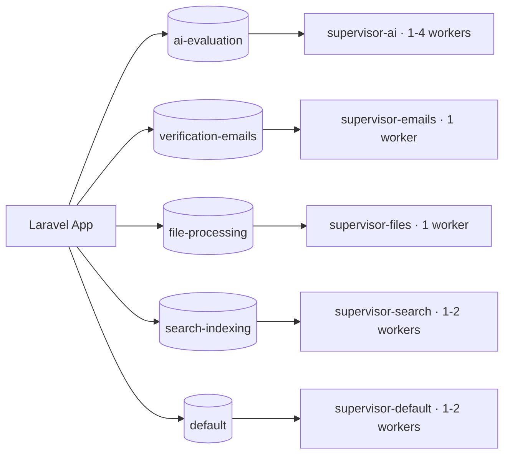

# إعدادات Horizon — منصة إحياء (Ihyaa)

**الإصدار:** v1.0
**التاريخ:** 2026-08-02
**المرجع:** `CLAUDE.md` (Async AI via Queue) · `requirements/rate-limiting-spec.md` §3.6 · `docs/api/enums.md` §2.4 · `docs/architecture/backend-structure.md` §5

---

## 1. الغرض

مراقبة وإدارة قوائم انتظار Laravel عبر **Horizon** (Redis). المشروع يعتمد 4 قوائم مسماة + قائمة `default`:

| القائمة | الغرض | المهام |
|---------|-------|--------|
| `ai-evaluation` | تقييم AI (مكلف — أولوية قصوى) | `RunAiEvaluationJob` · `EvaluateDimensionJob` (5) · `GenerateGapAnalysisJob` |
| `verification-emails` | بريد المعاملات فقط (لا جماعي) | `SendOtpEmailJob` · `SendVerificationEmailJob` · `SendNotificationEmailJob` |
| `file-processing` | معالجة الملفات المرفوعة | `ProcessUploadedFileJob` |
| `search-indexing` | مزامنة فهرس Meilisearch | `SyncProjectToSearchJob` |
| `default` | بقية المهام | `GenerateAgreementPdfJob` وغيرها |



## 2. التثبيت

```bash
composer require laravel/horizon
php artisan vendor:publish --provider="Laravel\Horizon\HorizonServiceProvider"
# config/horizon.php + app/Providers/HorizonServiceProvider.php
```

`.env`:

```
QUEUE_CONNECTION=redis
REDIS_HOST=127.0.0.1
REDIS_PORT=6379
```

**لوحة Horizon محمية بدور المشرف فقط** (`app/Providers/HorizonServiceProvider.php`):

```php
use Illuminate\Support\Facades\Gate;
use Laravel\Horizon\Horizon;
use App\Enums\UserRole;

public function boot(): void
{
    Horizon::auth(function ($request) {
        return $request->user()?->role === UserRole::ADMIN->value;
    });
}
```

## 3. `config/horizon.php` — القوائم الأربع

```php
<?php

use Illuminate\Support\Str;

return [

    'domain' => env('HORIZON_DOMAIN'),
    'path' => env('HORIZON_PATH', 'horizon'),
    'use' => 'default',
    'prefix' => env('HORIZON_PREFIX', Str::slug(env('APP_NAME', 'laravel'), '_').'_'),
    'middleware' => ['web'],
    'waits' => [
        'redis:ai-evaluation' => 180,          // انتظار قبل إطلاق عملية جديدة (ثوانٍ)
        'redis:verification-emails' => 60,
        'redis:file-processing' => 300,
        'redis:search-indexing' => 60,
        'redis:default' => 60,
    ],
    'trim' => [
        'recent' => 60,
        'pending' => 120,
        'completed' => 60,
        'recent_failed' => 10080,
        'failed' => 10080,
        'monitored' => 10080,
    ],
    'silenced' => [],
    'metrics' => [
        'trim_snapshots' => ['job' => 24, 'queue' => 24],
    ],
    'fast_termination' => false,
    'max_requests' => 0,
    'memory_limit' => 64,

    /*
    |--------------------------------------------------------------------------
    | الإعدادات الافتراضية لكل مشرف (تُورَّث لكل البيئات)
    |--------------------------------------------------------------------------
    */
    'defaults' => [
        'supervisor-ai' => [
            'connection' => 'redis',
            'queue' => ['ai-evaluation'],
            'balance' => 'auto',
            'autoScalingStrategy' => 'time',
            'minProcesses' => 1,
            'maxProcesses' => 2,
            'maxTime' => 0,
            'maxJobs' => 0,
            'memory' => 256,                   // ذاكرة أعلى: تقييم AI يحمل JSON كبير
            'tries' => 2,
            'timeout' => 180,                  // سقف التقييم الكلي (enums.md §2.4)
            'nice' => 0,
        ],
        'supervisor-emails' => [
            'connection' => 'redis',
            'queue' => ['verification-emails'],
            'balance' => 'simple',
            'minProcesses' => 1,
            'maxProcesses' => 1,
            'maxTime' => 0,
            'maxJobs' => 0,
            'memory' => 128,
            'tries' => 3,
            'timeout' => 60,
            'nice' => 0,
        ],
        'supervisor-files' => [
            'connection' => 'redis',
            'queue' => ['file-processing'],
            'balance' => 'simple',
            'minProcesses' => 1,
            'maxProcesses' => 1,
            'maxTime' => 0,
            'maxJobs' => 0,
            'memory' => 128,
            'tries' => 2,
            'timeout' => 300,                  // ملفات كبيرة (صور 5MB / PDF 10MB)
            'nice' => 0,
        ],
        'supervisor-search' => [
            'connection' => 'redis',
            'queue' => ['search-indexing'],
            'balance' => 'simple',
            'minProcesses' => 1,
            'maxProcesses' => 1,
            'maxTime' => 0,
            'maxJobs' => 0,
            'memory' => 128,
            'tries' => 3,
            'timeout' => 60,
            'nice' => 0,
        ],
        'supervisor-default' => [
            'connection' => 'redis',
            'queue' => ['default'],
            'balance' => 'simple',
            'minProcesses' => 1,
            'maxProcesses' => 1,
            'maxTime' => 0,
            'maxJobs' => 0,
            'memory' => 128,
            'tries' => 3,
            'timeout' => 60,
            'nice' => 0,
        ],
    ],

    /*
    |--------------------------------------------------------------------------
    | البيئات — تُضاف فوق الافتراضيات
    |--------------------------------------------------------------------------
    */
    'environments' => [
        'production' => [
            'supervisor-ai' => [
                'minProcesses' => 1,
                'maxProcesses' => 4,
                'balanceMaxShift' => 1,
                'balanceCooldown' => 1,
            ],
            'supervisor-emails' => ['maxProcesses' => 1],
            'supervisor-files' => ['maxProcesses' => 1],
            'supervisor-search' => ['maxProcesses' => 2],
            'supervisor-default' => ['maxProcesses' => 2],
        ],
        'local' => [
            'supervisor-ai' => ['minProcesses' => 1, 'maxProcesses' => 1],
            'supervisor-emails' => ['maxProcesses' => 1],
            'supervisor-files' => ['maxProcesses' => 1],
            'supervisor-search' => ['maxProcesses' => 1],
            'supervisor-default' => ['maxProcesses' => 1],
        ],
    ],
];
```

> **ملاحظات:**
> - `tries` في المشرف حد أقصى شامل؛ تتحكم `backoff` داخل المهمة بالتأخير التصاعدي (0/3/9 ثوانٍ للتقييم — enums.md §2.4).
> - `timeout` هنا حد المشرف؛ والمهمة نفسها تعرّف `$timeout` الخاص بها (أصغر القيمتين يسري).
> - `waits` تمنع انطلاق عمليات جديدة لقائمة مشبعة — مهمة لقائمة AI المكلفة.

## 4. تعريف المهام — مثال كامل (تقييم AI)

```php
<?php

namespace App\Jobs\AiEvaluation;

use App\Models\Project;
use App\Services\Ai\EvaluationService;
use Illuminate\Contracts\Queue\ShouldQueue;
use Illuminate\Foundation\Queue\Queueable;

class RunAiEvaluationJob implements ShouldQueue
{
    use Queueable;

    public string $queue = 'ai-evaluation';   // القائمة المعتمدة
    public int $timeout = 180;                // سقف المعالجة (enums.md §2.4)
    public int $tries = 2;
    public int $backoff = 10;

    public function __construct(public Project $project) {}

    public function middleware(): array
    {
        // منع تداخل تقييمات المشروع نفسه
        return [new WithoutOverlapping("ai-evaluation:{$this->project->id}")];
    }

    public function handle(EvaluationService $service): void
    {
        $service->evaluate($this->project);
    }

    public function failed(\Throwable $e): void
    {
        // تحديث evaluation.status = failed + تسجيل السبب (متاح للمشرف)
    }
}
```

### 4.1 الحد: 3 تقييمات متزامنة لكل مستخدم (rate-limiting-spec §3.6)

لا يوفر Horizon حداً مدمجاً لكل مستخدم — يُنفَّذ عبر Middleware للمهمة:

```php
<?php

namespace App\Jobs\Middleware;

use Illuminate\Support\Facades\Cache;
use Illuminate\Contracts\Queue\Job;

class LimitConcurrentEvaluationsPerUser
{
    public function __construct(public int $limit = 3) {}

    public function handle(Job $job, callable $next): void
    {
        $userKey = $this->resolveUserKey($job);

        if ($userKey === null) {
            $next($job);
            return;
        }

        $lock = Cache::lock("eval:lock:{$userKey}", 180);

        // تحقق من عدد الأقفال النشطة بدل قفل واحد — عدّاد Redis:
        $active = Cache::increment("eval:active:{$userKey}", 1, 180);

        if ($active > $this->limit) {
            Cache::decrement("eval:active:{$userKey}");
            $job->release(10);                 // أعد المحاولة بعد 10 ثوانٍ
            return;
        }

        try {
            $next($job);
        } finally {
            Cache::decrement("eval:active:{$userKey}");
        }
    }

    private function resolveUserKey(Job $job): ?int
    {
        $payload = $job->payload();
        $data = $payload['data']['__laravel_serialized'] ?? null;
        // عملياً: تُمرَّر user_id صراحةً في خصائص المهمة
        return $job->resolveName() ? $job->getJob()->user_id ?? null : null;
    }
}
```

> **توصية أبسط في MVP:** أضف `user_id` كخاصية صريحة في `RunAiEvaluationJob` واقرأها مباشرة بدل `resolveUserKey()` — أسرع وأوضح.

### 4.2 Cache الـ 24 ساعة — خارج Horizon

قبل إطلاق `RunAiEvaluationJob` يتحقق `AiCacheService::isFresh($project)`:
- تقييم حديث (أقل من 24 ساعة) → يرفض الإطلاق ويعيد التقرير المخزّن.
- التقييم التلقائي عند الإنشاء: لا يُقيَّم إلا بعد إكمال الحقول الأساسية (العنوان + الوصف + الفئة).

## 5. التشغيل والمراقبة

| البيئة | الأمر |
|--------|-------|
| محلي (تطوير) | `php artisan horizon` (Terminal مخصص) |
| إنتاج (Forge/VPS) | عبر supervisor/systemd: `php artisan horizon` + `php artisan schedule:work` |
| إعادة تشغيل سلسة عند النشر | `php artisan horizon:terminate` (بعد الـ deploy — Horizon يعيد إطلاق نفسه) |
| لوحة المراقبة | `/horizon` — للمشرف فقط (Gate في القسم 2) |
| إحصائيات | `php artisan horizon:metrics` · `php artisan horizon:status` |

**مؤشرات يجب مراقبتها (Alerting):**
- `failed_jobs` — أي فشل في `ai-evaluation` (تكلفة مباشرة) يُنشئ إشعار مشرف.
- `eval:active:{user_id}` أعلى من 3 لفترة طويلة → ازدحام؛ ارفع `supervisor-ai.maxProcesses`.
- زمن P95 للتقييم > 120 ثانية → راجع `AiProviderService` (timeout الـ Sub-Agent 45s).
- Redis memory (docker-compose: `--maxmemory 64mb`) — قريب من السقف → وسّع أو خفّف TTL.

**الاختبارات:** في CI والاختبارات المحلية `QUEUE_CONNECTION=sync` (تنفيذ فوري بلا Workers)؛ اختبارات متكاملة منفصلة تُشغّل `php artisan queue:work --queue=ai-evaluation` مع Redis حقيقي للتحقق من التزامن (3 متزامنة/مستخدم، partial 3/5 ضمن 180s).

*نهاية الوثيقة — القيم المعتمدة من enums.md §2.4 وrate-limiting-spec §3.6.*
