# بنية Middleware وتحديد المعدل — منصة إحياء (Ihyaa)

**الإصدار:** v1.0
**التاريخ:** 2026-08-02
**المرجع الملزم:** `requirements/rate-limiting-spec.md` (7 مستويات) · `docs/api/routes.md` (49 نقطة) · `docs/design-decisions.md` §5.2 (الإفصاح)

---

## 1. مسار الطلب (Pipeline)

```mermaid
flowchart LR
    C[Client] --> G1[TrustProxies]
    G1 --> G2[HandleCors]
    G2 --> G3[PreventRequestsDuringMaintenance]
    G3 --> G4[SetLocale — Accept-Language]
    G4 --> R1[throttle: ... — Rate Limit]
    R1 --> R2[auth:sanctum]
    R2 --> R3[RefreshSanctumToken — 24h]
    R3 --> R4[email.verified]
    R4 --> R5[role: idea-owner / investor / admin]
    R5 --> P[Policy: can: ...]
    P --> CT[Controller]
```



- `SetLocale` **قبل** `throttle` حتى تصل رسائل 429 مترجمة.
- `throttle` قبل `auth` — يعمل بمفتاح IP احتياطي للمهاجمين غير المصادقين.

## 2. التسجيل في `bootstrap/app.php`

```php
<?php

use App\Http\Middleware\{
    AdminMiddleware,
    EnsureEmailVerified,
    IdeaOwnerMiddleware,
    InvestorMiddleware,
    RefreshSanctumToken,
    SetLocale,
    TrackRateLimitViolations,
};
use Illuminate\Foundation\Application;
use Illuminate\Foundation\Configuration\Exceptions;
use Illuminate\Foundation\Configuration\Middleware;
use Illuminate\Http\Request;
use Symfony\Component\HttpKernel\Exception\ThrottleRequestsException;

return Application::configure(basePath: dirname(__DIR__))
    ->withRouting(
        api: __DIR__.'/../routes/api.php',
        channels: __DIR__.'/../routes/channels.php',
        commands: __DIR__.'/../routes/console.php',
    )
    ->withMiddleware(function (Middleware $middleware) {
        // يعمل قبل باقي Middleware في مجموعة api
        $middleware->api(prepend: [SetLocale::class]);

        $middleware->alias([
            'idea-owner'     => IdeaOwnerMiddleware::class,
            'investor'       => InvestorMiddleware::class,
            'admin'          => AdminMiddleware::class,
            'email.verified' => EnsureEmailVerified::class,
            'token.refresh'  => RefreshSanctumToken::class,
            'rate.violations'=> TrackRateLimitViolations::class,
        ]);
    })
    ->withExceptions(function (Exceptions $exceptions) {
        // استجابة 429 موحّدة لكل نقاط /api (تغطي أي limiter)
        $exceptions->renderable(function (ThrottleRequestsException $e, Request $request) {
            if ($request->is('api/*')) {
                $headers = $e->getHeaders();
                $retryAfter = (int) ($headers['Retry-After'] ?? 60);

                return response()->json([
                    'code'        => 'RATE_LIMIT_EXCEEDED',
                    'message'     => __('rate_limit.exceeded', ['seconds' => $retryAfter]),
                    'retry_after' => $retryAfter,
                    'reset_at'    => (int) ($headers['X-RateLimit-Reset'] ?? now()->addSeconds($retryAfter)->timestamp),
                ], 429, $headers);
            }
        });
    })->create();
```

> هذا بديل EnsureRole السابق في `routes.md` §4 — تُستبدل ثلاثية الأدوار الجديدة (أدناه) الوسيط العام، وتُحدَّث المسارات من `role:idea-owner` إلى `idea-owner`.

## 3. Middleware الأدوار الثلاثة

قاعدة مشتركة + ثلاثة وسائط محددة:

```php
<?php

namespace App\Http\Middleware;

use App\Enums\UserRole;
use Closure;
use Illuminate\Auth\AuthenticationException;
use Illuminate\Http\Request;
use Symfony\Component\HttpFoundation\Response;

abstract class AbstractRoleMiddleware
{
    abstract protected function role(): UserRole;

    public function handle(Request $request, Closure $next): Response
    {
        $user = $request->user();

        if (! $user) {
            throw new AuthenticationException();
        }

        // أول دخول OAuth قبل اختيار الدور (SRS-F01-07) — يخبر الواجهة بفتح شاشة اختيار الدور
        if ($user->role === null) {
            return response()->json([
                'code'    => 'ROLE_REQUIRED',
                'message' => __('auth.role_required'),
            ], 409);
        }

        abort_unless($user->role === $this->role(), 403, __('auth.forbidden'));

        return $next($request);
    }
}
```

```php
<?php

namespace App\Http\Middleware;

use App\Enums\UserRole;

class IdeaOwnerMiddleware extends AbstractRoleMiddleware
{
    protected function role(): UserRole
    {
        return UserRole::IDEA_OWNER;
    }
}
```

```php
<?php

namespace App\Http\Middleware;

use App\Enums\UserRole;

class InvestorMiddleware extends AbstractRoleMiddleware
{
    protected function role(): UserRole
    {
        return UserRole::INVESTOR;
    }
}
```

```php
<?php

namespace App\Http\Middleware;

use App\Enums\UserRole;

class AdminMiddleware extends AbstractRoleMiddleware
{
    protected function role(): UserRole
    {
        return UserRole::ADMIN;   // يُنشأ عبر seeder فقط — لا تسجيل عام
    }
}
```

**كودات الخطأ الموحّدة:**

| الحالة | الكود | المعنى |
|--------|-------|--------|
| 401 | `UNAUTHENTICATED` | لا توكن أو منتهٍ |
| 403 | `FORBIDDEN` | دور صحيح لكن بلا تفويض (تُستخدم Policies للتفاصيل) |
| 409 | `ROLE_REQUIRED` | مستخدم OAuth جديد لم يختر الدور بعد |
| 422 | `VALIDATION_FAILED` | فشل Form Request |
| 429 | `RATE_LIMIT_EXCEEDED` | تجاوز الحد (الهيكل في القسم 4) |

## 4. Rate Limiting — المستويات السبعة (rate-limiting-spec.md)

### 4.1 Named Rate Limiters — `AppServiceProvider::boot()`

```php
<?php

namespace App\Providers;

use Illuminate\Cache\RateLimiting\Limit;
use Illuminate\Http\Request;
use Illuminate\Support\Facades\RateLimiter;
use Illuminate\Support\ServiceProvider;

class AppServiceProvider extends ServiceProvider
{
    public function boot(): void
    {
        $this->configureRateLimiting();
    }

    protected function configureRateLimiting(): void
    {
        // ---------------- L1: المصادقة (SRS-NFR-17) ----------------
        RateLimiter::for('auth.register', fn (Request $r) =>
            Limit::perMinute(3)->by($r->ip()));                                    // RL-AUTH-01
        RateLimiter::for('auth.login', fn (Request $r) =>
            Limit::perMinute(5)->by($r->input('email') ?: $r->ip()));              // RL-AUTH-02
        RateLimiter::for('auth.logout', fn (Request $r) =>
            Limit::perMinute(10)->by($r->user()?->id ?: $r->ip()));                // RL-AUTH-03
        RateLimiter::for('auth.email-verify', fn (Request $r) =>
            Limit::perMinute(3)->by($r->input('email') ?: $r->user()?->id ?: $r->ip())); // RL-AUTH-04
        RateLimiter::for('auth.forgot-password', fn (Request $r) =>
            Limit::perMinute(2)->by($r->input('email') ?: $r->ip()));              // RL-AUTH-05
        RateLimiter::for('auth.reset-password', fn (Request $r) =>
            Limit::perMinute(2)->by($r->input('email') ?: $r->ip()));              // RL-AUTH-06
        RateLimiter::for('auth.oauth', fn (Request $r) =>
            Limit::perMinute(5)->by($r->ip()));                                    // RL-AUTH-07/08

        // ---------------- L2: التصفح العام (IP) ----------------
        RateLimiter::for('public.browse', fn (Request $r) =>
            Limit::perMinute(30)->by($r->ip()));                                   // RL-PUB-01/03/04/05
        RateLimiter::for('public.detail', fn (Request $r) =>
            Limit::perMinute(60)->by($r->ip()));                                   // RL-PUB-02 (مخزّن مؤقتاً)

        // ---------------- L3: صاحب فكرة ----------------
        RateLimiter::for('idea-owner.read', fn (Request $r) =>
            Limit::perMinute(60)->by($r->user()?->id ?: $r->ip()));
        RateLimiter::for('idea-owner.write', fn (Request $r) =>
            Limit::perMinute(10)->by($r->user()?->id ?: $r->ip()));

        // ---------------- L4: مستثمر ----------------
        RateLimiter::for('investor.read', fn (Request $r) =>
            Limit::perMinute(120)->by($r->user()?->id ?: $r->ip()));
        RateLimiter::for('investor.write', fn (Request $r) =>
            Limit::perMinute(10)->by($r->user()?->id ?: $r->ip()));

        // ---------------- L5: العمليات المكلفة (AI + رفع) ----------------
        RateLimiter::for('ai.analyze', fn (Request $r) =>
            Limit::perMinute(3)->by($r->user()?->id.':'.$r->route('project')));    // RL-AI-01 user+project
        RateLimiter::for('ai.evaluate', fn (Request $r) =>
            Limit::perMinute(3)->by($r->user()?->id.':'.$r->route('project')));    // SRS-API-44..46
        RateLimiter::for('ai.report', fn (Request $r) =>
            Limit::perMinute(10)->by($r->user()?->id ?: $r->ip()));                // RL-AI-02 + SRS-API-48
        RateLimiter::for('upload.file', fn (Request $r) =>
            Limit::perMinute(10)->by($r->user()?->id ?: $r->ip()));                // RL-IO-03/07

        // ---------------- L6: المشرف ----------------
        RateLimiter::for('admin.read', fn (Request $r) =>
            Limit::perMinute(60)->by($r->user()?->id ?: $r->ip()));                // RL-ADM-01
        RateLimiter::for('admin.export', fn (Request $r) =>
            Limit::perMinute(10)->by($r->user()?->id ?: $r->ip()));                // RL-ADM-02

        // ---------------- L3+L4: نقاط مشتركة (حد حسب الدور) ----------------
        RateLimiter::for('shared.read', function (Request $r) {
            $user = $r->user();
            $limit = $user && $user->role === 'investor' ? 120 : 60;
            return Limit::perMinute($limit)->by($user?->id ?: $r->ip());
        });
        RateLimiter::for('shared.write', fn (Request $r) =>
            Limit::perMinute(10)->by($r->user()?->id ?: $r->ip()));
        RateLimiter::for('dashboard', fn (Request $r) =>
            Limit::perMinute(20)->by($r->user()?->id ?: $r->ip()));                // RL-IO-09/RL-INV-09
    }
}
```

**مطابقة المستويات (الملحق ب من المواصفة):**

| المستوى | النطاق | Limiters |
|---------|--------|----------|
| L1 | المصادقة | `auth.*` |
| L2 | التصفح العام | `public.*` |
| L3 / L3-W | صاحب فكرة | `idea-owner.read` / `idea-owner.write` |
| L4 / L4-W | مستثمر | `investor.read` / `investor.write` |
| L5 | AI + رفع | `ai.analyze` · `ai.evaluate` · `ai.report` · `upload.file` |
| L6 | مشرف | `admin.read` · `admin.export` |
| L7 | Health/Meta | بلا تحديد — IP داخلي فقط في الإنتاج |

**ملاحظة Burst (السماح بالانفجار):** Laravel لا يدعم burst أصلاً داخل `Limit`. MVP يكتفي بالنافذة الدقيقة (Sliding Window) — والمواصفة تشير إليه كميزة تخفيف لا كحدّ حاسم. عند الحاجة لاحقاً: `RateLimiter::for('public.burst', fn (Request $r) => Limit::perSeconds(10, 10)->by($r->ip()))` يُضاف على نفس المسار.

### 4.2 رؤوس الاستجابة

Laravel يضيف تلقائياً `X-RateLimit-Limit` · `X-RateLimit-Remaining` · `X-RateLimit-Reset` على كل استجابة، و`Retry-After` عند 429. الهيكل الموحد لـ 429 (عربي/إنجليزي حسب `SetLocale`):

```json
{
    "code": "RATE_LIMIT_EXCEEDED",
    "message": "عدد الطلبات تجاوز الحد المسموح. يرجى المحاولة بعد 30 ثانية.",
    "retry_after": 30,
    "reset_at": 1721380900
}
```

## 5. تطبيق الـ Rate Limit على مجموعات المسارات

التعريف الكامل للـ 49 نقطة معتمد في `docs/api/routes.md` — هنا بنية المجموعات وربط الـ Middleware:

| المجموعة | الـ Middleware | Rate Limiters |
|-----------|----------------|---------------|
| Health | — | L7 — بلا تحديد |
| Auth عام | `throttle:auth.*` | register 3 · login 5 · forgot 2 · reset 2 · oauth 5 |
| تصفح عام | `throttle:public.*` | browse 30 · detail 60 |
| مصادق (قاعدة) | `auth:sanctum` + `token.refresh` | — |
| Shared (أي دور) | `throttle:shared.read` / `shared.write` | قراءة 60/120 · كتابة 10 |
| Idea Owner | `idea-owner` | `idea-owner.write` (المشاريع) · `upload.file` (الملفات) · `ai.evaluate` · `ai.report` · `dashboard` |
| Investor | `investor` | `investor.write` (اهتمام/حفظ) · `shared.read` · `dashboard` |
| AI Agent | `idea-owner` | `ai.analyze` (3/دقيقة/مشروع) · `ai.report` |
| Admin | `admin` | `admin.read` · `admin.export` |

```php
// routes/api.php — البنية (التعريفات الكاملة في docs/api/routes.md)
Route::middleware('auth:sanctum')->group(function () {
    Route::post('/logout', [AuthController::class, 'logout'])
        ->middleware('throttle:auth.logout');
    Route::post('/email/verify', [AuthController::class, 'verifyEmail'])
        ->middleware('throttle:auth.email-verify');

    // مشترك — قراءة
    Route::middleware('throttle:shared.read')->group(function () {
        Route::get('/profile', [ProfileController::class, 'show']);
        Route::get('/interests/received', [InterestController::class, 'received']);
        Route::get('/notifications', [NotificationController::class, 'index']);
        // ...
    });

    // مشترك — كتابة
    Route::middleware('throttle:shared.write')->group(function () {
        Route::put('/profile', [ProfileController::class, 'update']);
        Route::put('/interests/{interest}/accept', [InterestController::class, 'accept']);
        // ...
    });

    // صاحب فكرة
    Route::middleware('idea-owner')->group(function () {
        Route::post('/projects', [ProjectController::class, 'store'])
            ->middleware('throttle:idea-owner.write');
        Route::post('/projects/{project}/evaluate', [EvaluationController::class, 'evaluate'])
            ->middleware('throttle:ai.evaluate');
        Route::post('/ai/analyze/{project}', [AIAgentController::class, 'analyze'])
            ->middleware('throttle:ai.analyze');
        // ...
    });

    // مستثمر
    Route::middleware('investor')->group(function () {
        Route::post('/projects/{project}/interest', [InterestController::class, 'store'])
            ->middleware('throttle:investor.write');
        Route::get('/saved-projects', [SavedProjectController::class, 'index'])
            ->middleware('throttle:shared.read');
        // ...
    });

    // مشرف
    Route::middleware('admin')->group(function () {
        Route::get('/admin/analytics', [AdminController::class, 'analytics'])
            ->middleware('throttle:admin.read');
        Route::get('/admin/analytics/export', [AdminController::class, 'export'])
            ->middleware('throttle:admin.export');
    });
});
```

> **قاعدة:** التحقق من الدور **مزدوج** — Middleware يفصل المجموعات، وPolicies تتحقق من التفويض الدقيق (ملكية المشروع، الإفصاح 1/2/3، طرفي الاتفاق).

## 6. معالجة الانتهاكات المتكررة (التصعيد ثلاثي المستويات — المواصفة §7)

```php
<?php

namespace App\Http\Middleware;

use Closure;
use Illuminate\Http\Request;
use Illuminate\Support\Facades\Cache;
use Illuminate\Support\Facades\Log;
use Symfony\Component\HttpFoundation\Response;

class TrackRateLimitViolations
{
    public function handle(Request $request, Closure $next): Response
    {
        $response = $next($request);

        if ($response->getStatusCode() !== 429) {
            return $response;
        }

        // المعرف: user_id للمصادق، IP للزائر — لا يُسجَّل بريد أو كلمة مرور أبداً (§7.4)
        $key = (string) ($request->user()?->id ?? $request->ip());
        $violations = Cache::increment("rate_limit_violations:{$key}", 1, 3600);

        Log::warning('rate_limit.429', [
            'key' => $key,
            'path' => $request->path(),
            'violations' => $violations,
        ]);

        // المستوى 2: منع مؤقت — 4-7 انتهاكات في الساعة → Retry-After 120
        if ($violations >= 4) {
            Log::error('rate_limit.temporary_block', ['key' => $key, 'violations' => $violations]);
        }

        // المستوى 3: منع مطوّل — 8+ → Retry-After 600 + تنبيه مشرف
        if ($violations >= 8) {
            Log::critical('rate_limit.extended_block', ['key' => $key, 'violations' => $violations]);
            // TODO v1.1: إشعار مشرف (إلغاء الحظر اليدوي مؤجل للمواصفة §10.3)
        }

        return $response;
    }
}
```

التطبيق: على مسارات المصادقة الحساسة (تسبق `throttle` حتى ترى استجابة 429):

```php
Route::post('/login', [AuthController::class, 'login'])
    ->middleware(['rate.violations', 'throttle:auth.login']);
```

العدادات كلها في Redis مع TTL ساعة (SRS-NFR-19) — لا جدول MySQL، والمسح اليدوي في الطوارئ عبر `php artisan cache:clear` لقيم `rate_limit_violations:*` فقط.

## 7. Middleware مساندة

### 7.1 `EnsureEmailVerified` (alias: `email.verified`)

```php
public function handle(Request $request, Closure $next): Response
{
    $user = $request->user();
    abort_if($user && $user->email_verified_at === null, 403, 'EMAIL_NOT_VERIFIED');
    return $next($request);
}
```

يُطبَّق على نقاط الحساسة (رفع مشروع، إبداء اهتمام، AI) — لا على التصفح العام.

### 7.2 `SetLocale`

```php
public function handle(Request $request, Closure $next): Response
{
    $locale = in_array($request->getPreferredLanguage(['ar', 'en']), ['ar', 'en'], true)
        ? $request->getPreferredLanguage(['ar', 'en'])
        : 'ar';
    app()->setLocale($locale);
    return $next($request);
}
```

الافتراضي **عربي** (Arabic-first). يسبق `throttle` لترجمة رسائل 429.

### 7.3 `RefreshSanctumToken` (alias: `token.refresh`)

توكن Sanctum صلاحيته 24 ساعة (SRS-NFR-07) مع تجديد تلقائي عند الاستخدام:

```php
public function handle(Request $request, Closure $next): Response
{
    $token = $request->user()?->currentAccessToken();
    if ($token && $token->expires_at && $token->expires_at->isPast()) {
        // تجديد لـ 24 ساعة إضافية من آخر نشاط
        $token->forceFill(['expires_at' => now()->addHours(24)])->save();
    }
    return $next($request);
}
```

## 8. قنوات WebSocket (Reverb) — أحداث حرجة فقط

```php
// routes/channels.php
use App\Models\User;
use Illuminate\Support\Facades\Broadcast;

Broadcast::channel('private-users.{userId}', fn (User $user, int $userId) =>
    (int) $user->id === $userId);
```

- مصادقة الاتصال عبر توكن Sanctum في رأس `Authorization` (`config/reverb.php` → `apps.providers.users.driver = sanctum`).
- الأحداث الحرجة فقط: `interest.created` · `evaluation.completed` (enums.md §2.9).
- حدود الاتصال: 10 اتصالات/دقيقة لكل مستخدم · أقصى جلسة 30 دقيقة — تُنفَّذ عبر `max_connections` في إعداد Reverb على مستوى التطبيق؛ الحد لكل مستخدم يُوثَّق كشرط MVP (تنفيذ مخصص مؤجل).

## 9. اختبارات (Pest)

```php
// tests/Feature/Middleware/RoleMiddlewareTest.php
test('investor cannot create a project', function () {
    $investor = User::factory()->investor()->create();

    $this->actingAs($investor, 'sanctum')
        ->postJson('/api/projects', Project::factory()->raw())
        ->assertForbidden();
});

test('oauth user without role receives 409 ROLE_REQUIRED', function () {
    $user = User::factory()->create(['role' => null]);

    $this->actingAs($user, 'sanctum')
        ->getJson('/api/dashboard/investor')
        ->assertStatus(409)
        ->assertJson(['code' => 'ROLE_REQUIRED']);
});

test('login is rate limited to 5 attempts per minute per email', function () {
    foreach (range(1, 5) as $i) {
        $this->postJson('/api/login', ['email' => 'a@b.c', 'password' => 'x']);
    }
    $this->postJson('/api/login', ['email' => 'a@b.c', 'password' => 'x'])
        ->assertStatus(429)
        ->assertJsonStructure(['code', 'message', 'retry_after', 'reset_at'])
        ->assertHeader('Retry-After');
});
```

*نهاية الوثيقة — الأرقام ملزمة من rate-limiting-spec.md، والتعريفات من routes.md.*
